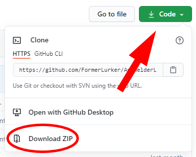

# Coding Club 18 Mars

## 📥 Installation Python et ses outils:

<details>
    <summary>🪟 Windows 10/11 (Microsoft Store)</summary>

1. Installez Python à partir du Microsoft Store :
    - Ouvrez le Microsoft Store et recherchez "Python".
    - Cliquez sur "Obtenir" pour télécharger et installer Python.
</br>
2. Une fois l'installation terminée, ouvrez une invite de commande (CMD) et tapez "python" pour vérifier que Python est installé et fonctionne correctement.
</details>

<details>
    <summary>🪟 Windows 10/11 (Téléchargement Direct)</summary>

1. Téléchargez l'installateur Python à partir du site officiel : 
<a href="https://www.python.org/downloads/windows/">https://www.python.org/downloads/windows</a>
        </br>
        2. Cliquez sur le bouton "Download Python X.X.X" pour télécharger le programme d'installation.
        </br>
        3. Exécutez le programme d'installation et suivez les instructions à l'écran.
        </br>
        4. Cochez la case "Add Python X.X to PATH" pour ajouter Python à la variable d'environnement PATH de Windows.
        </br>
        5. Sélectionnez "Install Now" pour installer Python.
        </br>
        6. Une fois l'installation terminée, ouvrez une invite de commande (CMD) et tapez "python" pour vérifier que Python est installé et fonctionne correctement.
</details>

<details>
    <summary>🍎 Macos</summary>

1. Ouvrez un navigateur Web et accédez à la page de téléchargement de Python : <a href="https://www.python.org/downloads/mac-osx/">https://www.python.org/downloads/mac-osx/</a>
</br>
2. Téléchargez l'installateur de la dernière version stable de Python.
</br>
3. Ouvrez le fichier téléchargé et double-cliquez sur l'icône du package d'installation Python.
</br>
4. Suivez les instructions à l'écran pour installer Python.
</br>
5. Une fois l'installation terminée, ouvrez un terminal et tapez "python" pour vérifier que Python est installé et fonctionne correctement.
</details>

<details>
    <summary>🐧 Linux (Ubuntu)</summary>

1. Ouvrez un terminal.

2. Mettez à jour les dépôts et les paquets système en tapant les commandes suivantes :

```bash
sudo apt-get update
sudo apt-get upgrade
```

3. Installez Python en tapant la commande suivante :

```bash
sudo apt-get install python3
```

4. Une fois l'installation terminée, tapez "python3" pour vérifier que Python est installé et fonctionne correctement.
</details>
</br>
<details>
    <summary>Installation des outils Python</summary>

PIP est deja installé sur windows et macos, donc si vous n’êtes pas sur linux vous pouvez passer à l’instalation PyGame.

<details>
    <summary>Installation PIP (Pas macos ou windows 10/11)</summary>

Pour installer les outils Python, vous pouvez utiliser le gestionnaire de paquets pip. Pip est inclus dans Python 2.7.9+ et Python 3.4+. Si pip n'est pas installé, vous pouvez l'installer en utilisant la commande suivante :

```bash
sudo apt-get install python3-pip
```
</details>

<details>
    <summary>Installation PyGame</summary>

Pour installer le module PyGame, utilisez la commande suivante:

```bash
pip install pygame
```
</code>
</details>
</details>

</br>

## 🎉Fin de l’installation

Maintenant que vous avez terminé l'installation de Python et de ses outils sur votre système d'exploitation, vous êtes prêt à attaquer votre projet, et télécharger les resources !

> 📘 Info
>
> **Si vous bloquez, rappelez-vous que vous êtes accompagné(e) ! Demandez de l’aide à vos camarades ou à un Cobra.**

**Sujet en format PDF**

[sujet.pdf](readme_files/sujet.pdf)

</br>

### 📥 **Lien de téléchargement des resources:**

Pour télécharger les ressources pour le projet, cliquez sur le lien suivant :

[**https://github.com/reuban-bryenton/cc-le-reve-de-robotnik**](https://github.com/reuban-bryenton/cc-le-reve-de-robotnik)



**Comment télécharger sur github ^^**
<br></br>
**Voici une exemple à quoi votre projet pourrait ressembler à la fin de la journée.**


### Aide en ligne:

Voici quelques ressources utiles pour le développement de jeux basiques en Pygame :

- La documentation officielle de Pygame : [pygame.org/docs](https://www.pygame.org/docs/)
- Les tutoriels Pygame sur le site officiel : [pygame.org/tags/tutorial](https://www.pygame.org/tags/tutorial)
- Le subreddit Pygame pour des discussions et de l'aide : [r/pygame](https://www.reddit.com/r/pygame/)

J'espère que ces ressources vous seront utiles pour votre développement de jeux en Pygame !
